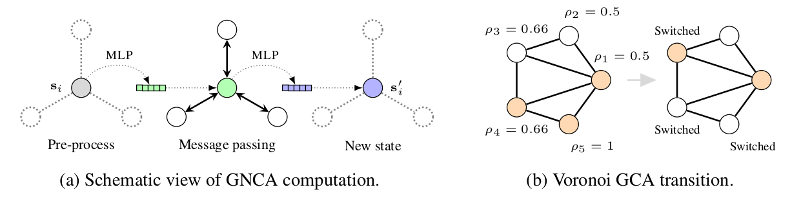

# Learning Graph Cellular Automata



This code implements the experiments from the NeurIPS 2021 paper: 

**"Learning Graph Cellular Automata"**  
_Daniele Grattarola, Lorenzo Livi, Cesare Alippi_

[Paper](https://arxiv.org/abs/2110.14237) | 
[Blog](https://danielegrattarola.github.io/posts/2021-11-08/graph-neural-cellular-automata.html)

Bibtex: 

```
@article{grattarola2021learning,
  title={Learning graph cellular automata},
  author={Grattarola, Daniele and Livi, Lorenzo and Alippi, Cesare},
  journal={Advances in Neural Information Processing Systems},
  volume={34},
  pages={20983--20994},
  year={2021}
}
```

## Setup 

The dependencies of the project are listed in `requirements.txt`. You can install them with:

```sh
pip install -r requirements.txt
```

## Reproducing experiments

Most scripts have CLI options that you can use to control the behaviour.
Run:

```shell
python [script_name].py --help
```

to see a list of options.

### Voronoi GCA


The experiments with the Voronoi GCA can be reproduced using the scripts in the 
`voronoi` folder. 

To train the GNCA:

```shell
python run_voronoi.py
```

To compute the entropy of the GNCA after every training step:

```shell
python run_voronoi_entropy.py
```

To plot the entropies as a function of the rule's threshold:

```shell
python run_entropy_v_th.py
```

### Boids


The experiments with the Boids GCA can be reproduced using the scripts in the 
`boids` folder. 

To train the GNCA:

```shell
python run_boids.py
```

To compute the complexity of the GNCA every 10 training steps:

```shell
python run_boids.py --test_complexity_every 10
```

To make all the plots included in the paper, after training the GNCA with `run_boids.py`:

```shell
python evaluate_boids.py
```

To train the minimal MLP that implements the transition rule:

```shell
python run_learn_exact_mlp.py
```

### Fixed target


The experiments to train the GNCA to converge to a fixed target can be 
reproduced using the scripts in the `fixed_target` folder.

To train the GNCA:

```shell
python run_fixed_target.py  # By default, t=10
```

To train the GNCA by sampling t randomly in a range:

```shell
python run_fixed_target.py --min_steps 10 --max_steps 21  # t \in [10, 20]
```

To make all plots included in the paper:

```shell
python make_plots.py --path results/Grid2d/  # Replace with target folder for each graph
```

